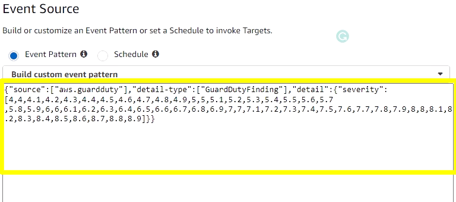
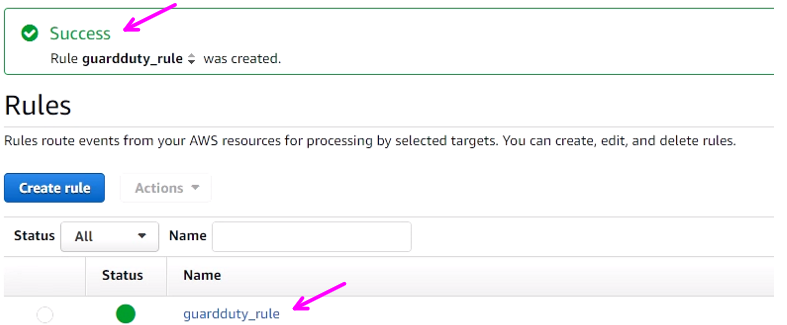
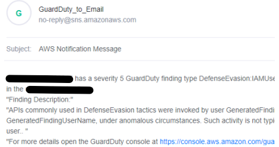

# AWS-Cloud-Security

> Objective: 
>* 1. GuardDuty: Cloud Watch
>* 2. AWS CloudTrail: Creating Trail
>* 3. AWS CloudTrail: Athena and CloudWatch Alerts

> Backround/definitions: GuardDuty detects malicious activities and sends events to Amazon CloudWatch Events for every change in a finding. Through continuous alerts about malicious activities, users can take the necessary precautions to mitigate the risk of cyber attacks.

# 1. GuardDuty: Cloud Watch

Successfully configured a CloudWatch Event rule that will send a message to the SNS topic depending on the severity results of GuardDuty findings.

*The below json code will alert for any Medium to High finding.
>Code: {"source":["aws.guardduty"],"detail-type":["GuardDutyFinding"],"detail":{"severity":[4,4,4.1,4.2,4.3,4.4,4.5,4.6,4.7,4.8,4.9,5,5,5.1,5.2,5.3,5.4,5.5,5.6,5.7
,5.8,5.9,6,6,6.1,6.2,6.3,6.4,6.5,6.6,6.7,6.8,6.9,7,7,7.1,7.2,7.3,7.4,7.5,7.6,7.7,7.8,7.9,8,8,8.1,8.2,8.3,8.4,8.5,8.6,8.7,8.8,8.9]}}

* To format the email, for Template, paste the following code:

> Input Path:
{
"severity": "$.detail.severity",
"Account_ID": "$.detail.accountId",
"Finding_ID": "$.detail.id",
"Finding_Type": "$.detail.type",
"region": "$.region",
"Finding_description": "$.detail.description"
}

> Input Template:"You have a severity <severity> GuardDuty finding type <Finding_Type> in the <region> region."
"Finding Description:"
"<Finding_description>. "
"For more details open the GuardDuty console at https://console.aws.amazon.com/guardduty/home?region=<region>#/findings?search=id%3D<Finding_ID>"

* Succesfully made a rule
  

* Findings on GuardDuty

* Email Notification

# 2. AWS CloudTrail: Creating Trail (In Progres)

> Create trails for various types of events using AWS CloudTrail and deliver log files to an S3 Bucket.

# 3. AWS CloudTrail: Athena and CloudWatch Alerts (In Progres)

> Process the data with Amazon Athena and configure AWS CloudWatch alerts for CloudTrail events.

