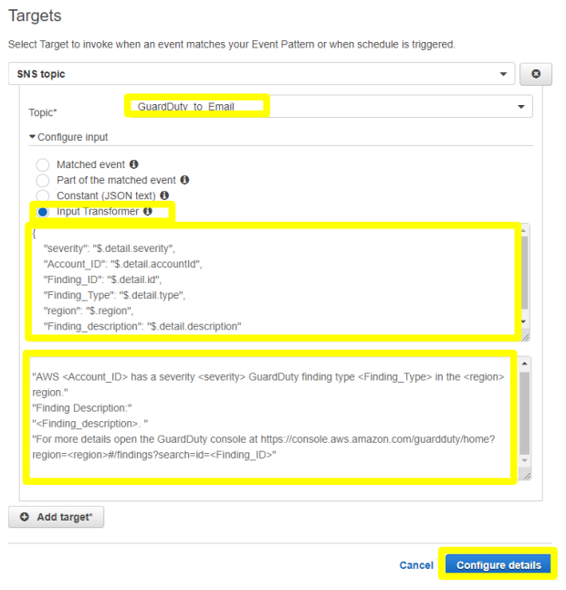
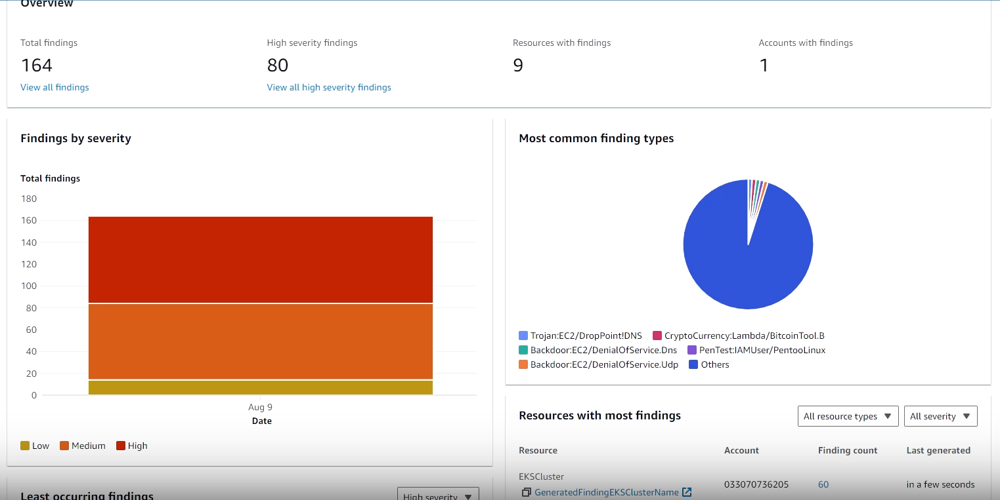
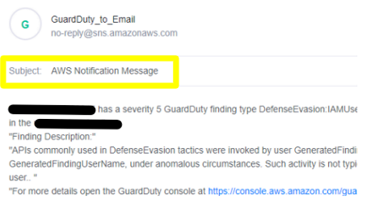

# AWS-Cloud-Security

> Objective: 
>* 1. GuardDuty: Cloud Watch
>* 2. AWS CloudTrail: Creating Trail
>* 3. AWS CloudTrail: Athena and CloudWatch Alerts
>* 4. Amazon Machie


# 1. GuardDuty: Cloud Watch

Successfully configured a CloudWatch Event rule that will send a message to the SNS topic depending on the severity results of GuardDuty findings.

> Backround/definitions: GuardDuty detects malicious activities and sends events to Amazon CloudWatch Events for every change in a finding. Through continuous alerts about malicious activities, users can take the necessary precautions to mitigate the risk of cyber attacks.
>* GuardDuty informs you of the status of your AWS environment by producing security findings that you can view in the GuardDuty console. More of a threat detection tool that focuses on identifying specific signs or indicators of a security incident.
>* CloudWatch provides monitoring and alerting for your AWS resources and applications (server, network, or database). Through continuous alerts about malicious activities, users can take the necessary precautions to mitigate the risk of cyber attacks. Think of it as keeping an eye out on the systems and identifying/fixing items as they rise

* The below json code will alert for any Medium to High finding.
```Json
{
   "source":[
      "aws.guardduty"
   ],
   "detail-type":[
      "GuardDutyFinding"
   ],
   "detail":{
      "severity":[
         4,
         4,
         4.1,
         4.2,
         4.3,
         4.4,
         4.5,
         4.6,
         4.7,
         4.8,
         4.9,
         5,
         5,
         5.1,
         5.2,
         5.3,
         5.4,
         5.5,
         5.6,
         5.7,
         5.8,
         5.9,
         6,
         6,
         6.1,
         6.2,
         6.3,
         6.4,
         6.5,
         6.6,
         6.7,
         6.8,
         6.9,
         7,
         7,
         7.1,
         7.2,
         7.3,
         7.4,
         7.5,
         7.6,
         7.7,
         7.8,
         7.9,
         8,
         8,
         8.1,
         8.2,
         8.3,
         8.4,
         8.5,
         8.6,
         8.7,
         8.8,
         8.9
      ]
   }
}
```


* To format the email, for Template, paste the following code:

> Input Path:
``` json
{
"severity": "$.detail.severity",
"Account_ID": "$.detail.accountId",
"Finding_ID": "$.detail.id",
"Finding_Type": "$.detail.type",
"region": "$.region",
"Finding_description": "$.detail.description"
}
```

> Input Template:
"AWS <Account_ID> has a severity <severity> GuardDuty finding type <Finding_Type> in the
<region> region."
"Finding Description:"
"<Finding_description>. "
"For more details open the GuardDuty console at
https://console.aws.amazon.com/guardduty/home?region=<region>#/findings?search=id=<Findi
ng_ID>"



* Succesfully made a rule
  


* Findings on GuardDuty



* Email Notification




# 2. AWS Cloud Trail: Creating Trail 

Created trails for various types of events using AWS CloudTrail and deliver log files to an S3 Bucket.

> Backround/definitions: CloudTrail tracks/records API activity in an AWS Account. This can help aide risk auditing, governance and compliance within AWS accounts. There are three types of events that can be logged in CloudTrail: management events, data events, and CloudTrail Insights events.
>* Management events - Configuring security, Registering devices , Configuring rules, Setting up logging
>* Data events - Data events provide information about the resource operations performed on or in a resource.
>* CloudTrail Insights events - CloudTrail Insights events capture unusual API call rate or error rate activity in your AWS account by analyzing CloudTrail management activity. For example, associated API, error code, incident time, and statistics, that help you understand and act on unusual activity

* Created a Management Event & an Insight Event. P.S - Insights events will only work with management events.
  


 

* Created a Data Event Trail and set data event type as “DynamoDB”. You can determine the request that was made to
DynamoDB, the IP address from which the request was made, who made the request, when it
was made, and additional details.


* Exploring Logs


# 3. AWS CloudTrail: Athena and CloudWatch Alerts


> Process the data with Amazon Athena and configure AWS CloudWatch alerts for CloudTrail events.


# 4. Amazon Macie 

> Setting up a job in Amazon Macie to discover sensitive information within a S3 bucket.
